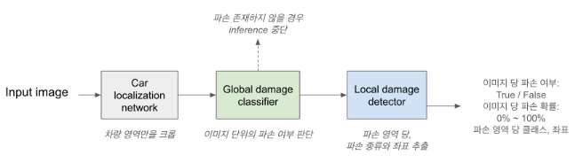
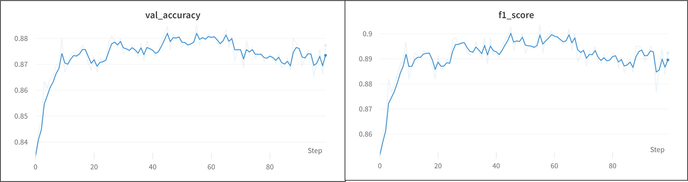
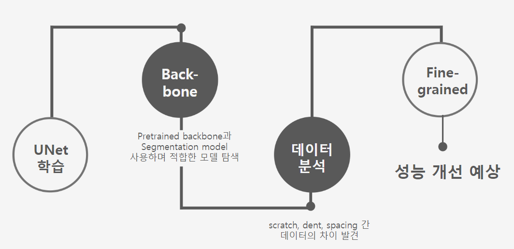
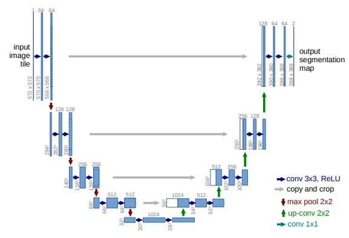
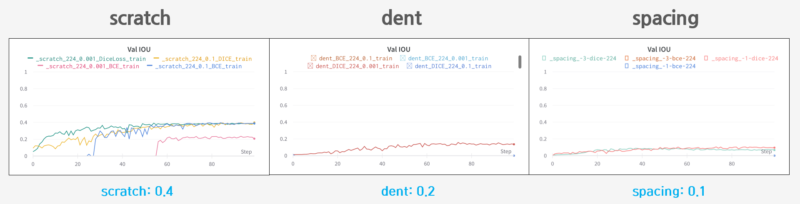
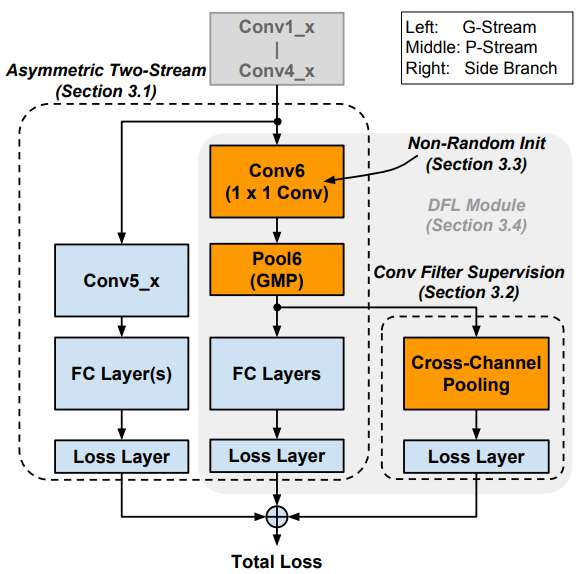
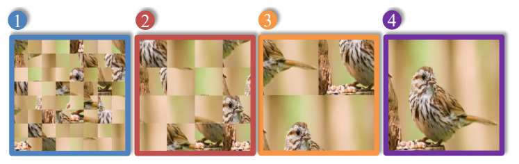

# Aiffel X Socar

#### 제 3차 해커톤 : AIFFELTHON

 > TEAM : **이음**

##  주제 : 차량 파손 탐지 

### 1. 프로젝트 개요
+ 문제 제기
    - 현재 Socar 파손 탐지 모델은 classifier에서 정상/파손 이미지를 구분함
    - **파손과 비슷한 형태의 오염**이 segmentation 모델의 입력으로 사용될 가능성이 있음

    

현재 SOCAR 파손 탐지 모델 

 

+ 문제 정의
    - 파손과 유사한 오염/파손을 구분하는 **Classification** 문제
    - 이미지에서 파손 여부를 탐지하고, 파손 종류를 구분하는 **Segmentation** 문제

 

+ 해결 방안
    - **정상 / 파손 / 오염을 분류**하는 Classifier 사용
    - 분류된 파손 이미지를 **scratch / dent / spacing으로 파손 종류 및 영역 탐지**

 

### 2. 실험 절차 및 방법
<ul>
    

        
    

    
실험 절차 

</ul>

+ ##### Classifier 
    + 정상/오염/파손 이미지 분류
        + EfficientNet B0
            + Inception보다 파라미터 수가 적은데 정확도는 비슷함
            + 결과(그래프)
                 원본 데이터는 비공개
                <figure align = 'center'>
                    
                    <figcaption> val_acc : 0.87, F1 score : 0.89 </caption>
                </figure> 

+ ##### Segmentation
    + 파손 영역 탐지
        

            
        

        
 Segmentation 실험 절차 

        
     

    + U-Net 모델 사용
        적은양의 데이터셋 에도 좋은 성능을 보여주는 특징으로 Baseline 모델로 선택
        <figure align = 'center'>
            
            <figcaption> U-Net 구조 </caption>
        </figure>

    + 수행 과정
        1. Hyperparameter tuning
        2. Pretrained Backbone
        3. Fine-grained Backbone

 

### 3. 실험 결과
+ #### U-Net 하이퍼파라미터 튜닝 결과
<figure align ='center'>
     
    <figcaption> IOU Score 기준 최대 성능</figcaption>
</figure>

+ #### Backbone Model
    + 개선 아이디어
        - backbone 모델 사용
        - 다른 segmentation 모델 사용
        
            |모델||||
            |---|---|---|---|
            |U-Net| Efficientnet b0 | Efficientnet b2 | Resnet50 |
            |DeeplabV3+| Efficientnet b0 | Efficientnet b2 | Resnet50 |

+ ###### Backbone 모델 적용 결과
    + U-Net
        - 

    + DeeplabV3+
        - 
 

+ #### Fine-graine Backbone
    + 마스킹 이미지당 파손 비율

    + 개선 아이디어
        + **Fine-grained mlodel**로 학습된 backbone 사용

    + 프로세스
        1. 이미지넷으로 학습된 Fine-grained model(DFL-CNN, PMG)
        2. 파손 종류 데이터로 classification 학습
        3. 학습된 weight를 U-Net의 encoder에 적용
        4. segmentation 재학습

    + Fine grained model
        + DFL-CNN
            - 여러개의 feature map 사용
        + PMG
            - 이미지를 여러 크기의 패치 단위로 쪼개어 학습

+ ###### DFL-CNN
    
    <figure align ='center'>
         
        <figcaption> DFL 구조</figcaption>
    </figure>

+ ###### PMG
    <figure align ='center'>
         
        <figcaption> PMG 구조</figcaption>
    </figure>

### 4. 추후 연구 방향
1. 오염 정도 측정 자동화
    - 오염 이미지로부터 오염 정도를 분류하는 분류기 생성
    -> 하나의 과정으로 세차 등 오염에 대한 대처 가능

2. classification out of boundary 연구
    - 정상/오염/파손 분류기에서 잘못 분류한 이미지에 대해 out of boundary 연구를 통해 개선

 

    
	
	

- - -

###### [REEFERENCES]

- [쏘카 기술 블로그](https://tech.socarcorp.kr/data/2020/02/13/car-damage-segmentation-model.html#index3)
- [U-Net: Convolutional Networks for Biomedical Image Segmentation](https://arxiv.org/pdf/1505.04597.pdf)
- [Learning a Discriminative Filter Bank within a CNN for Fine-grained Recognition](https://arxiv.org/pdf/1611.09932.pdf)
- [Fine-Grained Visual Classification via Progressive Multi-Granularity Training of Jigsaw Patches](https://arxiv.org/pdf/2003.03836.pdf)
- []